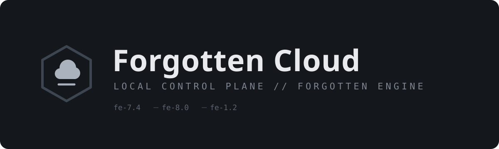

<p align="center">
  
</p>

# Forgotten Cloud

**A local, Aternos-style control panel for [Forgotten Engine](https://github.com/podkarpacie/Forgotten-Engine) worlds.**
No accounts. No registration. Runs on your machine — open `http://127.0.0.1:4870` and manage everything from the browser.

## What it does

| Area | Features |
|---|---|
| **Server creation** | Wizard: name → compatibility profile (`fe-7.4`) → engine release tag → options. Provisions the world via `forgotten-engine init` (panel-side skeleton fallback), auto-allocates a free port block per world. |
| **Engine manager** | Fetches `fe-v*` tags from GitHub (cached, offline fallback list). Installs the matching binary: release asset download → `cargo build --release` from source → local binary copy. Install jobs stream progress. |
| **Lifecycle** | Start / stop / restart with real PID + uptime; immediate-crash detection surfaces engine errors instead of faking success. |
| **Console** | Live SSE stream, persisted run logs under `.fc/logs/`, `/broadcast` and `/clear` panel commands, stdin forwarding. |
| **Files** | Full explorer: browse, edit (with Ctrl+S), create, rename, delete, upload, download — guarded against path escapes. |
| **Config manager** | Form-based editing of every recognized `config.lua` key with comments preserved byte-for-byte on save. |
| **Database** | Browse tables/rows of `data/forgotten-engine.db` (node:sqlite), read-only SQL console by default, write mode gated to stopped servers, CSV/JSON export, plus account/player actions bridged through the engine CLI. |
| **Backups** | Manual + scheduled zips (retention policy), pre-restore safety snapshots, restore in one click. |
| **Export / Import** | Download the entire world as a zip; import any world zip as a new server with fresh ports. |
| **Plugins** | Registry + `data/plugins/<id>/manifest.json` detection and per-world toggles — ready to light up the moment the Forgotten Engine plugin SDK ships. No fabricated ratings or stats. |
| **Forgotten AAC** | Reserved `aac/` workspace per world for the upcoming MyAAC-style web panel. |
| **Appearance** | Dark / Light / Midnight modes × 4 accent themes, ambient animations (reducible), remembered via cookies. Fully local preferences. |
| **Clients** | Per-protocol asset slots (operator-supplied `.spr`/`.dat`), packaged client-build registry, per-world client zip download — pairs Forgotten-Client builds with the world's protocol and connection settings. |

## Quick start

```bash
pnpm install
pnpm dev          # API on 127.0.0.1:4870 + Vite dev server on 5173
```

Production:

```bash
pnpm build
pnpm start        # serves UI + API on http://127.0.0.1:4870
```

Point **Settings → Engine source checkout** at your Forgotten Engine clone to build binaries locally, or set an explicit prebuilt binary path.

## Honest status

Forgotten Engine itself is ~48% complete (~24% production-ready). Where the engine hasn't shipped yet — full Lua scripting, official-client sessions, AAC bundle — Forgotten Cloud provides working scaffolds and truthful messaging rather than fake buttons. Everything that *is* implemented upstream (init/run/validate lifecycle, config subset, SQLite persistence, backup primitives, OTClientV8 native path) is fully operable through this panel.

## Repository layout

```
server/            Express host, supervisor, installer, config writer
  routes/          servers · files · database · backups · system
  engine/          catalog (tags) · installer (release/build/local) · supervisor
client/src/
  pages/           dashboard · wizard · engine · plugins · settings · server tabs
  components/ui/   shadcn-style kit (trimmed)
  lib/theme.tsx    cookie-persisted theme engine
```

MIT licensed. Not affiliated with CipSoft; no official client assets are distributed.
